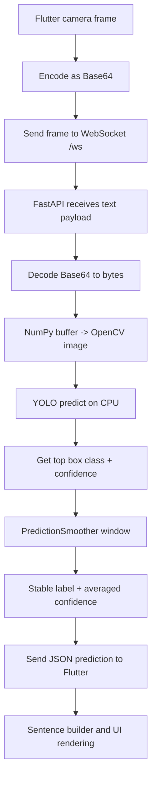

# VANI ML README

This file explains the machine learning part of your project in an exam-friendly way.

## 1) What ML does in this project

VANI uses a custom YOLO model to detect Indian Sign Language (ISL) signs from camera frames in real time.

- Input: Camera image frames from Flutter app
- ML task: Object detection / classification of hand sign in each frame
- Output: Predicted label + confidence score
- Runtime path: Flutter -> WebSocket -> FastAPI -> YOLO -> WebSocket -> Flutter UI

The ML model is served by backend code in `isl_backend/app.py` and loaded from `isl_backend/model/isl_best.pt`.

## 2) Model used

- Framework: Ultralytics YOLO (`ultralytics>=8.3.0`)
- Runtime: CPU inference (`loaded_model.to("cpu")`)
- Weights file: `isl_best.pt`
- Inference tuning:
	- `CONF_THRESHOLD = 0.30`
	- `MAX_DET = 1`
	- `FRAME_SKIP_MS = 80` (to control effective FPS on CPU)

### Why YOLO here

YOLO is suitable because:

- It is fast enough for near real-time inference
- It can detect and classify in one pass
- It is robust for camera-based tasks
- Ultralytics API is easy to deploy in FastAPI

## 3) End-to-end ML pipeline flow



## 4) Startup and model loading pipeline

When backend starts:

1. Creates `model/` directory if missing.
2. Checks whether `model/isl_best.pt` exists and is valid.
3. If missing/corrupt, downloads from Google Drive using `gdown` (fallback `urllib`).
4. Loads model using `YOLO(MODEL_PATH)`.
5. Moves model to CPU and runs `fuse()` for faster inference.
6. Stores global `model` instance for all WebSocket sessions.

This makes deployment simple: even if model is not bundled in image, server can fetch it at boot.

## 5) Per-frame inference logic

For every message on `/ws`:

1. Backend receives frame text.
2. Handles protocol commands:
	 - `__PING__` -> returns `pong`
	 - `__STOP__` -> resets smoother
3. Applies throttle using `FRAME_SKIP_MS`.
4. Decodes image to OpenCV format.
5. Runs `model.predict(frame, conf=0.30, max_det=1, device="cpu")`.
6. If detection exists:
	 - take first box
	 - extract class id -> label using `model.names`
	 - extract confidence
7. If no detection:
	 - use label `No Sign`, confidence `0.0`
8. Passes result to `PredictionSmoother`.
9. Sends response JSON:

```json
{
	"type": "prediction",
	"label": "hello",
	"confidence": 0.92,
	"frame": 118
}
```

## 6) Stabilization strategy (very important for viva)

Raw frame-by-frame predictions can flicker. This project uses two layers of stabilization:

### Layer A: Backend smoothing (`PredictionSmoother`)

- Maintains a sliding window (`deque`) of recent predictions.
- Chooses dominant label by frequency in that window.
- Averages confidence only for dominant label.

Effect: Reduces random jitter and unstable labels.

### Layer B: Frontend temporal logic (in `TranslateScreen.dart`)

- `_AutoAddEngine` enforces:
	- minimum stability duration (`_stabilityMs`)
	- cooldown for same word
	- cooldown for any word

Effect: Better sentence building, fewer repeated accidental tokens.

## 7) Vocabulary scope used in model pipeline

In frontend sentence engine (`TranslateScreen.dart`), the recognized operational vocabulary is a 25-word set:

- hello
- how are you
- i
- please
- today
- time
- what
- name
- quiet
- yes
- thankyou
- namaste
- bandaid
- help
- strong
- mother
- food
- father
- brother
- love
- good
- bad
- sorry
- sleeping
- water

These are mapped into:

- solo responses (`_solo`)
- pair grammar rules (`_pairs`)
- triple grammar rules (`_triples`)

So the ML output is not just displayed as labels; it becomes meaningful sentence-level communication.

## 8) Theory section for exams

### 8.1 Problem type

The core ML problem is real-time vision-based sign recognition using object detection outputs.

### 8.2 Why confidence threshold is needed

Confidence threshold filters weak predictions. Here `conf=0.30` removes very low-trust detections and improves output quality.

### 8.3 Why frame throttling is needed

CPU inference on every frame can overload server. `FRAME_SKIP_MS=80` limits inference frequency to about 12 FPS, balancing latency and stability.

### 8.4 Why max_det=1

For this use case, one dominant sign per frame is expected. `MAX_DET=1` simplifies output and improves consistency.

### 8.5 Latency vs accuracy tradeoff

- Higher FPS -> more responsive but more noisy and CPU-heavy
- Lower FPS + smoothing -> slightly delayed but cleaner predictions

This project chooses practical real-time behavior over raw maximum throughput.

### 8.6 Core detection metrics you can mention in exam

- Precision: fraction of predicted signs that are correct
- Recall: fraction of true signs that are detected
- mAP: overall detection quality across classes and IoU thresholds
- Confidence score: model probability-like output per detection

You can write these in short as:

- $Precision = \frac{TP}{TP + FP}$
- $Recall = \frac{TP}{TP + FN}$

## 9) Deployment-oriented ML choices in this project

- CPU-only model execution for broad compatibility
- Model auto-download for reproducible startup
- Stateless per-frame inference in WebSocket loop
- Keepalive handling (`ping/pong`) for long sessions
- Defensive try/except around decoding and prediction

## 10) Known limitations and future improvements

Current limitations:

- Single-sign dominant assumption (`max_det=1`)
- No explicit tracking of temporal sign sequence in backend
- CPU inference can still be heavy under high concurrency

Possible improvements:

1. Quantized model or TensorRT/ONNX runtime for speed
2. Batch queue or worker pool for multi-user scaling
3. Add temporal model (LSTM/Transformer) for dynamic gestures
4. Class-specific confidence thresholds
5. Add active learning pipeline from misclassifications

## 11) One-page exam answer template (copy-ready)

VANI uses a custom YOLO-based computer vision model to recognize Indian Sign Language gestures from live camera frames. The Flutter app captures frames and sends them as Base64 through a WebSocket to a FastAPI backend. The backend decodes frames with OpenCV/NumPy and performs CPU inference using `isl_best.pt`. It applies confidence filtering (`0.30`), maximum one detection per frame, and prediction smoothing via a sliding window. The backend returns label-confidence JSON to the client, where an auto-add engine and sentence builder convert stable labels into meaningful language output. This architecture gives low-latency, real-time assistance while controlling noise through throttling, smoothing, and cooldown logic.

